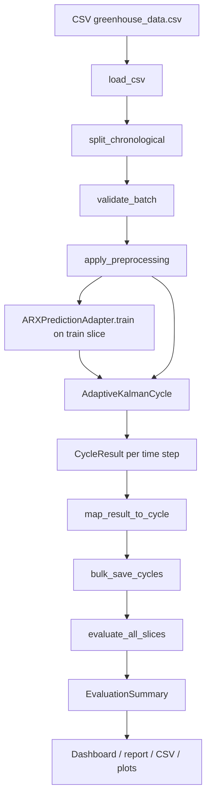
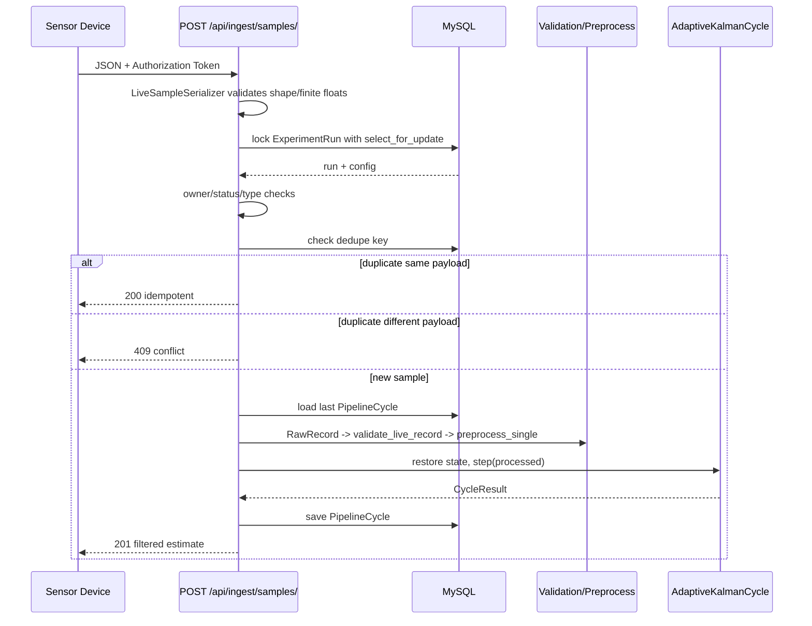
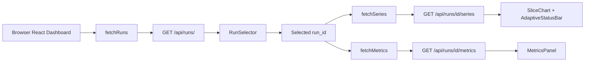
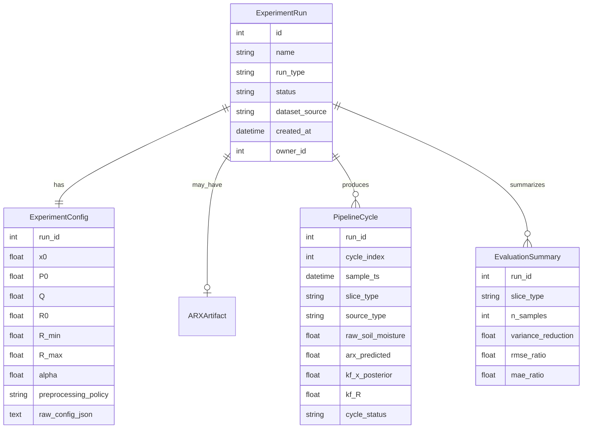

# Kalman Folder Review

Ngày tạo: 2026-04-17  
Phạm vi: `Kalman/` trong repo `Demo_kalman`  
Mục đích: giải thích folder này có gì, từng nhóm file làm gì, và luồng xử lý Adaptive Kalman end-to-end.

## Tóm Tắt Nhanh

`Kalman/` là project smart greenhouse tập trung vào v1 estimation pipeline:

```text
Sensor / CSV dataset
  -> validation
  -> preprocessing
  -> ARX prediction baseline
  -> Adaptive Kalman update
  -> store pipeline cycles
  -> evaluation metrics / exports
  -> dashboard visualization
```

Stack chính:

- Backend: Django + Django REST Framework + MySQL.
- Estimation core: Python dataclasses + NumPy.
- Frontend dashboard: Vite + React + TypeScript + TanStack Query + Recharts + Tailwind CSS.
- Test: pytest / pytest-django cho backend, Vitest / Testing Library cho frontend.

Project hiện tại đã có 13 task hoàn thành trong `.tasks/`, từ project setup đến ingestion, ARX adapter, Kalman cycle, storage, evaluation, dashboard, live ingest, robustness tests, methodology docs, và AMPC handoff.

## Những Thứ Không Nên Xem Là Source Chính

Trong folder local có thể có các artifact/generated file sau:

- `Server/backend/.env`: local secret/config. Không đọc nội dung vào docs, không commit.
- `Server/backend/__pycache__/`, `Server/backend/**/__pycache__`: Python bytecode cache.
- `Server/backend/.pytest_cache/`: cache của pytest.
- `Server/dashboard/node_modules/`: dependency đã install từ npm.
- `Server/dashboard/dist/`: frontend build output.
- `Server/dashboard/node_modules/.vite/`, `node_modules/.tmp/`: cache của Vite/TypeScript/Vitest.

Các thứ này có ích lúc chạy local, nhưng không phải nơi để sửa logic.

## Cây Thư Mục Cấp Cao

```text
Kalman/
  .tasks/                 # Task specs đã hoàn thành và template task
  backend/                # Django backend + estimation pipeline
  dashboard/              # React/Vite dashboard
  docs/                   # Technical, user, content docs
  CLAUDE.md               # Hướng dẫn cho agent làm việc trong project
  PRD.md                  # Product Requirements Document, source of truth
  README.md               # Project overview
  TODO.md                 # Backlog/status task
```

## Root Files

| File | Vai trò |
|---|---|
| `README.md` | Tổng quan project, tech stack, cách setup/running/build/test ở mức cao. Một số nội dung còn là scaffold ban đầu nên không đầy đủ bằng docs technical hiện tại. |
| `PRD.md` | Source of truth về sản phẩm: mục tiêu greenhouse, estimation-first v1, success metrics, functional/non-functional requirements, AMPC readiness. Chỉ nên sửa khi product requirement thay đổi. |
| `TODO.md` | Backlog/status. Hiện tại không có task in-progress/up-next/backlog; 13 task đã completed. |
| `CLAUDE.md` | Hướng dẫn cho coding agents: project context, rules, test conventions, commands, docs quan trọng. Có thể bị hiển thị lỗi dấu trong terminal Windows nếu encoding không đúng, nhưng vẫn là file context chính. |

## Folder `.tasks/`

`.tasks/` ghi lại từng đơn vị công việc đã làm. Mỗi file là một task spec / acceptance context.

| File | Nội dung |
|---|---|
| `TASK_TEMPLATE.md` | Mẫu tạo task mới. |
| `000-initial-project-setup.md` | Khởi tạo project, structure, task protocol. |
| `001-resolve-v1-estimation-decisions.md` | Chốt các quyết định v1 cho Adaptive Kalman / AMPC readiness. |
| `002-design-experiment-data-model.md` | Thiết kế data model, bảng DB, traceability. |
| `003-offline-dataset-ingestion-preprocessing.md` | Offline CSV ingestion và preprocessing policies. |
| `004-arx-prediction-adapter.md` | Contract prediction adapter và ARX baseline. |
| `005-kalman-estimation-cycle.md` | Adaptive Kalman-ready cycle. |
| `006-experiment-configuration-persistence.md` | RunConfig và config persistence. |
| `007-store-run-outputs-pipeline-logs.md` | Store cycle outputs, status transitions, pipeline logs. |
| `008-evaluation-metrics-report-export.md` | Metrics, reports, CSV/plot export. |
| `009-raw-predicted-filtered-dashboard.md` | Dashboard compare raw/predicted/filtered. |
| `010-live-sensor-ingestion-path.md` | Live sensor ingestion endpoint. |
| `011-missing-noisy-data-robustness-tests.md` | Tests cho missing/noisy/malformed data. |
| `012-v1-methodology-demo-workflow.md` | Methodology và demo workflow cho v1. |
| `013-synthesize-ampc-state-cost-safety-constraints.md` | AMPC state/cost/safety handoff docs. |

## Backend Overview

Backend nằm trong `Server/backend/`.

```text
backend/
  manage.py
  requirements.txt
  requirements-dev.txt
  pytest.ini
  conftest.py
  .env.example
  config/
  estimation/
```

### Backend Config Files

| File | Vai trò |
|---|---|
| `manage.py` | Django CLI entrypoint. Chạy `python manage.py check`, migrations, shell, v.v. |
| `requirements.txt` | Runtime dependencies: Django, mysqlclient, python-dotenv, numpy, pandas, DRF, CORS headers, matplotlib/seaborn optional for plot export. |
| `requirements-dev.txt` | Dev/test dependencies: pytest, pytest-django, pip-audit. |
| `pytest.ini` | Cấu hình pytest-django: settings module, test patterns, markers. |
| `conftest.py` | Test bootstrap, fixture/global test config. |
| `.env.example` | Template env vars. Không chứa secret thật. |

### `backend/config/`

| File | Vai trò |
|---|---|
| `config/__init__.py` | Package marker. |
| `config/settings.py` | Django settings: load `.env`, security flags, installed apps, middleware, DRF auth/permission, CORS, sessions, MySQL DB. Production bắt buộc `DJANGO_SECRET_KEY`; dashboard GET APIs default authenticated trong production nếu không override. |
| `config/urls.py` | Root URL router. Gắn `/api/` vào `estimation.api.urls`. |

Security/config đang có:

- Production: `DJANGO_ENV=production` bắt buộc secret không rỗng.
- `DEBUG=False` trong production.
- Security middleware, session, CSRF, auth, messages, XFrame.
- DRF default authentication: session + token.
- DRF default permission: production fail-safe `IsAuthenticated`, local demo có thể `AllowAny`.
- CORS origins split được bằng comma hoặc whitespace.
- MySQL dùng charset `utf8mb4`, strict mode `STRICT_TRANS_TABLES`.

## Backend Domain Models

File chính: `backend/estimation/models.py`.

### `ExperimentRun`

Một run offline replay hoặc live estimation.

Fields quan trọng:

- `name`: tên run.
- `run_type`: `offline_replay` hoặc `live`.
- `status`: `pending`, `running`, `completed`, `failed`, `aborted`.
- `dataset_source`: đường dẫn CSV hoặc mô tả query/source.
- `started_at`, `completed_at`, `created_at`.
- `owner`: user được phép POST live samples cho live run.

Quan hệ:

- 1 run có 1 `ExperimentConfig`.
- 1 run có nhiều `PipelineCycle`.
- 1 run có nhiều `EvaluationSummary`.
- 1 run có thể có 1 `ARXArtifact`.

### `ExperimentConfig`

Snapshot config cho một run, one-to-one với `ExperimentRun`.

Nhóm fields:

- Kalman: `x0`, `P0`, `Q`, `R0`, `R_min`, `R_max`, `alpha`.
- Split: `train_ratio`, `val_ratio`, `test_ratio`.
- ARX: `arx_na`, `arx_nb`, `arx_nk`.
- Preprocessing: `preprocessing_policy`.
- `raw_config_json`: JSON snapshot đầy đủ để reproduce.

Ý nghĩa: khi run đã bắt đầu thì config không nên bị sửa. `run_config/service.py` enforce điều này.

### `ARXArtifact`

Lưu model ARX đã train cho run.

Fields:

- ARX orders: `na`, `nb`, `nk`.
- Provenance: `n_train_samples`, `train_start_ts`, `train_end_ts`.
- Model: `coefficients_json`, `input_cols_json`, `output_col`.
- Metrics: `rmse_train`, `rmse_val`, `mae_train`, `mae_val`.
- Optional path: `artifact_path`.

### `PipelineCycle`

Bảng quan trọng nhất. Một row = một time step đã xử lý trong run.

Nhóm fields:

- Identity: `run`, `sample_ts`, `cycle_index`, `slice_type`, `source_type`.
- Raw measurements: `raw_soil_moisture`, `raw_temperature`, `raw_humidity`, `raw_light`, `raw_drip`, `raw_mist`, `raw_fan`.
- Preprocessing: `preprocess_status`.
- Prediction: `arx_predicted`.
- Kalman internals: `kf_x_prior`, `kf_P_prior`, `kf_innovation`, `kf_R`, `kf_K`, `kf_x_posterior`, `kf_P_posterior`.
- Adaptive/status: `adaptive_status`, `cycle_status`, `error_message`.
- Performance: `latency_ms`.
- Dedupe: `ingest_dedupe_key`.

Constraints:

- Unique `(run, cycle_index)`.
- Unique `(run, ingest_dedupe_key)`.
- Check constraints cho enum fields.
- Index `(run, sample_ts)` và `(run, slice_type)`.

### `EvaluationSummary`

Aggregated metrics per run per slice.

Fields:

- Counts: `n_samples`, `n_valid`, `n_skipped`, `n_error`.
- ARX/Kalman metrics: RMSE, MAE.
- ADR-003 gates: variance reduction, RMSE ratio, MAE ratio.
- Adaptive distribution: `n_r_updated`, `n_r_skipped`, `n_adaptive_skipped`.
- Latency: mean / p95.
- Diagnostics: innovation, R, P.
- Pass/fail flags.

## Backend Module Map

```text
estimation/
  api/           # REST API for dashboard + live ingest
  evaluation/    # Metrics, report, CSV/plot export
  ingestion/     # CSV loader, validation, preprocessing
  kalman/        # Adaptive Kalman scalar estimator
  migrations/    # Django schema migrations
  pipeline/      # Map CycleResult -> PipelineCycle, bulk save, run lifecycle
  prediction/    # Prediction adapter contract + ARX implementation
  run_config/    # In-memory RunConfig + DB service
  tests/         # Backend test suite
  models.py      # ORM data model
```

## `estimation/ingestion/`

### `loader.py`

Chịu trách nhiệm:

- Đọc CSV greenhouse dataset.
- Convert row thành `RawRecord`.
- Parse `Timestamp` theo format `%Y-%m-%d %H:%M:%S`, gắn UTC cho timestamp naive.
- Convert numeric fields sang `float | None`.
- Skip row có timestamp không parse được.
- `split_chronological()` sort theo timestamp và chia train/validation/test.

Key types:

- `RawRecord`: frozen dataclass cho raw source row.
- `DatasetSplit`: train/validation/test lists.

### `validator.py`

Chịu trách nhiệm:

- Validate physical bounds cho sensor fields.
- Phân loại status: `valid`, `missing`, `out_of_range`, `suspicious_repeat`.
- Guard NaN/Inf.
- Offline validator `validate_record()` yêu cầu đầy đủ numeric fields.
- Live validator `validate_live_record()` cho phép ancillary fields vắng mặt, nhưng `soil_moisture` vắng mặt thì skip measurement update.
- `validate_batch()` validate cả sequence với rolling window để detect stuck sensor.

Key types:

- `ValidationConfig`: min/max bounds và repeat threshold.
- `ValidationResult`: `is_valid`, `status`, `reason`.

### `preprocessor.py`

Chịu trách nhiệm:

- Biến raw + validation thành `ProcessedRecord`.
- Đảm bảo out-of-range/non-trusted values không đi thẳng vào ARX/Kalman.
- Hỗ trợ 3 policies:
  - `keep_last`: thay invalid row bằng last valid values.
  - `interpolate`: nội suy từ last valid và next valid.
  - `skip`: set effective values thành `None`, Kalman sẽ bỏ measurement update.
- `preprocess_single()` dùng cho live ingest, mặc định skip invalid single sample.

Key type:

- `ProcessedRecord`: giữ `raw`, `validation`, `preprocess_status`, và effective sensor values.

## `estimation/prediction/`

### `base.py`

Định nghĩa boundary cho mọi prediction model.

Key types:

- `PredictionInput`: history window của `ProcessedRecord`.
- `PredictionResult`: `value`, `status`, `model_kind`, `reason`.
- `PredictionAdapter`: abstract class bắt buộc adapter có `train()`, `predict()`, `save_artifact()`, `load_artifact()`.

Invariant quan trọng: `predict()` không nên raise; nếu lỗi thì return `status="error"` hoặc `status="unavailable"` để Kalman vẫn chạy tiếp.

### `arx_adapter.py`

ARX baseline cho v1.

Chịu trách nhiệm:

- Validate ARX config (`ARXTrainConfig`).
- Build OLS regression matrix từ `ProcessedRecord`.
- Train ARX bằng NumPy least squares.
- Predict next-step `Soil_Moisture`.
- Save/load artifact JSON.
- Load được cả native artifact và artifact format từ pipeline ARX cũ.

Key types/functions:

- `ARXTrainConfig`: `na`, `nb`, `nk`, `include_intercept`, `input_cols`, `output_col`.
- `ARXPredictionAdapter`: implementation của `PredictionAdapter`.
- `_records_to_arrays()`: sequence -> regression matrix.
- `_build_prediction_row()`: history window -> row vector.
- `_ols_fit()`: least-squares coefficients.

## `estimation/kalman/`

### `cycle.py`

Đây là core estimation.

Key types:

- `KalmanConfig`: hyperparameters `x0`, `P0`, `Q`, `R0`, `R_min`, `R_max`, `alpha`.
- `KalmanState`: mutable state giữa các step: `x_post`, `P_post`, `R`, `step`.
- `CycleResult`: output của 1 step, gồm raw/preprocess/prediction/Kalman internals/status/latency.
- `AdaptiveKalmanCycle`: estimator object.

Thuật toán scalar soil moisture:

1. Gọi prediction adapter nếu có đủ history.
2. Nếu ARX prediction ok: `x_prior = arx_predicted`; nếu không: carry previous posterior.
3. `P_prior = P_post_prev + Q`.
4. Nếu measurement missing/skipped:
   - `x_post = x_prior`
   - `P_post = P_prior`
   - `R` giữ nguyên
   - `cycle_status="skipped_no_measurement"`
   - `adaptive_status="R_skipped"`
5. Nếu measurement có:
   - innovation `e = z - x_prior`
   - adaptive measurement noise `R_new = clip(alpha * R_prev + (1-alpha) * e^2, R_min, R_max)`
   - Kalman gain `K = P_prior / (P_prior + R_new)`
   - posterior `x_post = x_prior + K * e`
   - posterior covariance `P_post = (1-K) * P_prior`
   - `cycle_status="ok"`
   - `adaptive_status="R_updated"`
6. `step()` được thiết kế "never raises"; exception đi vào `cycle_status="error"`.

## `estimation/pipeline/`

### `store.py`

Bridge giữa pure algorithm và DB.

Chịu trách nhiệm:

- `map_result_to_cycle()`: map `CycleResult` + run metadata thành unsaved `PipelineCycle`.
- Validate enum values trước khi tạo ORM object.
- Copy raw ancillary fields từ `ProcessedRecord` nếu có.
- Tạo `ingest_dedupe_key`.
- `bulk_save_cycles()`: bulk insert cycles.
- `begin_run()`: atomic transition `pending -> running`.
- `end_run()`: atomic transition `running -> completed|failed|aborted`.

Dedupe key:

- Live: `live|{run_id}|{UTC ISO timestamp}`.
- CSV replay: `csv|{run_id}|{cycle_index}`.
- MySQL replay: `mysql|{run_id}|{cycle_index}`.

## `estimation/run_config/`

### `config.py`

In-memory config object.

Key type:

- `RunConfig`: frozen dataclass gồm run metadata, Kalman config, split ratios, ARX config, preprocessing policy.

Chịu trách nhiệm:

- Validate Kalman fields bằng `KalmanConfig`.
- Validate ARX fields bằng `ARXTrainConfig`.
- Validate split ratios positive và sum = 1.
- Serialize/deserialize JSON.
- Reconstruct từ `ExperimentConfig` ORM row.

### `service.py`

DB service cho run config.

Functions:

- `create_run(config, run_type, notes, owner)`: atomic create `ExperimentRun` + `ExperimentConfig`.
- `load_config(run_id)`: load DB config thành `RunConfig`.
- `update_config(run_id, config)`: chỉ update nếu run còn `pending`; nếu run đã start thì raise `ConfigFrozenError`.

## `estimation/evaluation/`

### `metrics.py`

Pure metric computation, không phụ thuộc Django.

Key type:

- `SliceMetrics`: metrics cho 1 slice.

`compute_metrics(rows)` tính:

- Counts: samples, valid, skipped, error.
- Adaptive counts.
- Latency mean/p95.
- ARX RMSE/MAE.
- Kalman filtered RMSE/MAE.
- Variance reduction: `1 - var(diff(filtered)) / var(diff(raw))`.
- Guardrail ratios: `rmse_filtered / rmse_arx`, `mae_filtered / mae_arx`.
- Innovation diagnostics.
- R/P diagnostics.
- ADR-003 pass/fail flags.

Important: metric code dùng paired values để raw và filtered cùng index, tránh sai lệch khi có null/non-finite.

### `reporter.py`

DB integration + export.

Functions:

- `evaluate_slice(run_pk, slice_type)`: query cycles, compute metrics, persist `EvaluationSummary`.
- `evaluate_all_slices(run_pk)`: run cả train/validation/test.
- `build_text_report(run_pk)`: tạo text report cho báo cáo/demo.
- `export_to_csv(run_pk, output_path)`: export summary metrics.
- `export_plots(run_pk, output_dir)`: export plots raw/ARX/Kalman/innovation/R/residuals; matplotlib lazy import, nếu không có thì skip gracefully.

## `estimation/api/`

### `urls.py`

Routes:

- `GET /api/runs/`
- `GET /api/runs/<run_id>/series/`
- `GET /api/runs/<run_id>/metrics/`
- `POST /api/ingest/samples/`

### `views.py`

Read-only dashboard APIs.

- `RunListView`: trả 50 run mới nhất.
- `RunSeriesView`: trả time-series `PipelineCycle` cho chart.
  - Query params: `slice`, `limit`, `stride`.
  - Validate `slice` chỉ là `train|validation|test`; omit slice = all.
  - Cap `limit`, `stride`, và `limit * stride` để tránh query/memory DoS nhẹ.
- `RunMetricsView`: trả `EvaluationSummary` grouped by slice.

### `serializers.py`

Serializers cho dashboard API.

- `RunListSerializer`: expose id/name/type/status/created_at; không expose `dataset_source`.
- `CycleSerializer`: expose fields cần cho chart.
- `EvaluationSummarySerializer`: expose metrics và computed rates/gate.

### `live_serializers.py`

Serializer cho live ingest.

- `LiveSampleSerializer`: validate `run_id`, timestamp, sensor channels.
- Guard NaN/Infinity cho mọi float field.
- Optional sensor channels accept `null`; primary channel `soil_moisture` có thể null để Kalman skip measurement update.
- `LiveIngestResponseSerializer`: response shape documentation/test helper.

### `ingest.py`

Live ingestion endpoint.

`POST /api/ingest/samples/` flow:

1. DRF Token auth bắt buộc.
2. Validate JSON payload bằng `LiveSampleSerializer`.
3. Pre-check run tồn tại và là live run.
4. Trong transaction:
   - `select_for_update()` lock run row.
   - Re-check `run_type` và `status`.
   - Object-level auth: request user phải là `run.owner`.
   - Load `ExperimentConfig` -> `KalmanConfig`, fallback defaults nếu missing.
   - Normalize sample timestamp về UTC.
   - Tạo dedupe key.
   - Nếu timestamp đã ingest:
     - payload giống nhau -> return 200 idempotent.
     - payload khác -> return 409 conflict.
   - Lấy last persisted cycle để restore Kalman state.
   - Build `RawRecord`.
   - Validate live record.
   - `preprocess_single()`.
   - Tạo `AdaptiveKalmanCycle`, inject restored state.
   - Chạy `step()`.
   - Map result -> `PipelineCycle`.
   - Save.
5. Return 201 với cycle index, statuses, posterior estimate, innovation.

## Migrations

`backend/estimation/migrations/` là schema history của Django.

| File | Vai trò |
|---|---|
| `0001_initial.py` | Tạo schema ban đầu cho run/config/artifact/cycle/evaluation. |
| `0002_pipeline_cycle_adaptive_status_check_constraints.py` | Thêm/siết adaptive status và constraints. |
| `0003_evaluation_latency_adaptive_counts.py` | Thêm latency và adaptive counts vào evaluation. |
| `0004_experiment_run_owner_live_sample_ts_unique.py` | Thêm owner/live-related schema. |
| `0005_pipelinecycle_ingest_dedupe_key.py` | Thêm `ingest_dedupe_key`, backfill, resolve duplicates, unique constraint. |
| `__init__.py` | Package marker. |

## Backend Tests

`backend/estimation/tests/`:

| File | Test cái gì |
|---|---|
| `test_ingestion.py` | CSV loader, chronological split, validation, preprocessing policies, end-to-end ingestion basics. |
| `test_prediction.py` | ARX config, adapter training/predicting, artifact save/load, real data path. |
| `test_kalman.py` | Kalman config/state/result, step behavior, adaptive R, adapter integration, replay, never-raises invariant, real data. |
| `test_pipeline_store.py` | Mapping `CycleResult -> PipelineCycle`, bulk save, status transitions, traceability, enum guards, dedupe. |
| `test_pipeline_robustness.py` | Missing/noisy/malformed data robustness, injected defects, replay completion. |
| `test_run_config.py` | RunConfig validation, JSON, DB service create/load/update, immutability after start. |
| `test_evaluation.py` | Metrics, variance pairing, non-finite handling, evaluate slice/all, text report, CSV/plots, latency mapping. |
| `test_api.py` | Dashboard APIs: run list, series filtering/limit/stride/invalid slice, metrics response. |
| `test_live_ingest.py` | Token auth, owner auth, live run status guards, idempotency, conflict, state restore, timestamp normalization, validation. |

## Dashboard Overview

Dashboard nằm trong `Server/dashboard/`.

```text
dashboard/
  package.json
  package-lock.json
  vite.config.ts
  eslint.config.js
  tsconfig*.json
  index.html
  public/
  src/
```

### Dashboard Config Files

| File | Vai trò |
|---|---|
| `package.json` | Scripts và dependencies. Scripts: `dev`, `build`, `lint`, `preview`, `test`. |
| `package-lock.json` | Lockfile npm. |
| `vite.config.ts` | Vite config, React plugin, Tailwind plugin, dev proxy `/api -> http://127.0.0.1:8000`, Vitest jsdom setup. |
| `eslint.config.js` | ESLint flat config. |
| `tsconfig.json`, `tsconfig.app.json`, `tsconfig.node.json` | TypeScript configs. |
| `index.html` | HTML shell cho Vite. |
| `.gitignore` | Dashboard ignore rules. |
| `README.md` | Vite template README; chưa được custom hóa nhiều cho project. |

### `dashboard/src/`

| File/folder | Vai trò |
|---|---|
| `main.tsx` | React entrypoint, mount `App` vào `#root`. |
| `App.tsx` | App shell: QueryClientProvider, top bar, sidebar run list, main dashboard area. |
| `App.css` | CSS template/legacy nếu still imported elsewhere. |
| `index.css` | Global CSS/Tailwind entry. |
| `api/client.ts` | Thin fetch client cho `/api/runs/`, `/api/runs/:id/series/`, `/api/runs/:id/metrics/`. |
| `api/types.ts` | TypeScript API contracts matching backend serializers. |
| `components/RunSelector.tsx` | Sidebar list of experiment runs, status dot, selected run state. |
| `components/RunDashboard.tsx` | Fetch series + metrics for selected run; controls slice/stride; renders charts/status/metrics. |
| `components/SliceChart.tsx` | Recharts line chart raw sensor / ARX predicted / Kalman filtered. |
| `components/AdaptiveStatusBar.tsx` | Count and display adaptive status distribution. |
| `components/MetricsPanel.tsx` | Per-slice metrics table and pass/fail gate display. |
| `test/setup.ts` | Vitest/JSDOM setup. |
| `__tests__/*.test.tsx`, `apiClient.test.ts` | Frontend unit/component/API client tests. |
| `assets/hero.png`, `react.svg`, `vite.svg` | Static assets. React/Vite SVG là template assets, không phải core domain. |

### Dashboard Data Flow

```text
App.tsx
  -> RunSelector
       -> fetchRuns()
       -> GET /api/runs/
       -> user selects run_id
  -> RunDashboard(runId)
       -> fetchSeries(runId, {slice, limit: 4000, stride})
       -> GET /api/runs/{id}/series/
       -> SliceChart + AdaptiveStatusBar
       -> fetchMetrics(runId)
       -> GET /api/runs/{id}/metrics/
       -> MetricsPanel
```

`RunDashboard` default slice hiện tại là `train`, không phải `all`, để tránh view all bị skew về early cycle index khi backend apply limit.

## Existing Docs

### `docs/technical/`

| File | Vai trò |
|---|---|
| `ARCHITECTURE.md` | Tài liệu kiến trúc tổng thể. |
| `DATABASE.md` | Schema/data model reference. |
| `API.md` | REST API reference, auth/security/query params. |
| `DECISIONS.md` | Architecture/technical decisions. |
| `DESIGN_SYSTEM.md` | Dashboard design system notes. |
| `METHODOLOGY_V1.md` | V1 methodology/demo workflow. |
| `ADAPTIVE_KALMAN_AMPC_NOTES.md` | Notes về Adaptive Kalman + AMPC. |
| `AMPC_MODELING_HANDOFF.md` | Handoff cho v2 AMPC modeling: state/cost/constraints/safety. |
| `ONBOARDING_ANSWERS.md` | Q&A/onboarding context. |
| `BaoCao.md` | Draft/report content bằng tiếng Việt. |
| `Tonghop.md`, `Tonghop2.md` | Tổng hợp nội dung/report/research notes. |
| `KALMAN_FOLDER_REVIEW.md` | File này: folder inventory + flow processing. |

### `docs/user/`

| File | Vai trò |
|---|---|
| `USER_GUIDE.md` | Hướng dẫn người dùng/deploy/demo; có production deploy checklist. |

### `docs/content/`

| File | Vai trò |
|---|---|
| `CONTENT_STRATEGY.md` | Content strategy/communication docs. Không ảnh hưởng runtime. |

## Luồng Xử Lý Offline Replay

Hiện tại project có các module để chạy offline replay, nhưng không thấy một single CLI/management command orchestration riêng trong tracked files. Luồng offline được ghép từ các module sau:



Chi tiết:

1. Tạo `RunConfig`.
2. `create_run()` ghi `ExperimentRun` + `ExperimentConfig`.
3. `begin_run()` transition run sang `running`.
4. `load_csv()` đọc CSV thành `RawRecord[]`.
5. `split_chronological()` chia train/validation/test.
6. `validate_batch()` tạo `ValidationResult[]`.
7. `apply_preprocessing()` tạo `ProcessedRecord[]`.
8. Train `ARXPredictionAdapter` trên train slice; optional validation metrics trên validation slice.
9. Tạo `AdaptiveKalmanCycle(KalmanConfig, adapter=arx_adapter)`.
10. Replay từng `ProcessedRecord`:
    - ARX adapter predict prior nếu đủ history.
    - Kalman update hoặc skip measurement.
    - Trả `CycleResult`.
11. `map_result_to_cycle()` convert `CycleResult` thành `PipelineCycle`.
12. `bulk_save_cycles()` persist batch.
13. `end_run(run, "completed")`.
14. `evaluate_all_slices()` tính và persist `EvaluationSummary`.
15. `build_text_report()`, `export_to_csv()`, `export_plots()` nếu cần report.
16. Dashboard đọc qua REST API.

## Luồng Xử Lý Live Ingest



Điểm quan trọng:

- Endpoint live luôn yêu cầu token.
- Chỉ `run.owner` được ingest sample cho run đó.
- Run phải là `live` và `running`.
- State được restore từ last persisted cycle, nên reconnect được.
- Duplicate timestamp idempotent nếu payload giống nhau, conflict nếu payload khác.
- Live path v1 không dùng ARX adapter; Kalman prior fallback về previous posterior.

## Luồng Dashboard



Dashboard hiện tại là read-only:

- Không tạo run.
- Không start/end run.
- Không ingest live sample.
- Chỉ visualize persisted DB data thông qua API.

## Data Relationship Diagram



## AMPC Readiness

V1 chưa implement closed-loop AMPC controller. Nó không tính actuator schedule tối ưu, không dispatch water/fan/mist. Thay vào đó, V1 giữ các contract cần cho v2:

- State estimate: filtered `Soil_Moisture` từ `kf_x_posterior`.
- Uncertainty/noise: `kf_P_posterior`, adaptive `kf_R`.
- Disturbance/ancillary channels: temperature, humidity, light.
- Control traces: drip, mist, fan raw actuator fields.
- Diagnostics: innovation, latency, cycle/adaptive/preprocess status.
- Evaluation gates: variance reduction và guardrails RMSE/MAE.

Docs liên quan:

- `docs/technical/AMPC_MODELING_HANDOFF.md`
- `docs/technical/ADAPTIVE_KALMAN_AMPC_NOTES.md`
- `docs/technical/METHODOLOGY_V1.md`

## Nếu Muốn Sửa Tính Năng Thì Vào Đâu

| Mục tiêu | File/module nên sửa |
|---|---|
| Đổi validation bounds sensor | `backend/estimation/ingestion/validator.py` |
| Đổi preprocessing policy | `backend/estimation/ingestion/preprocessor.py` |
| Đổi Kalman math/defaults | `backend/estimation/kalman/cycle.py`, `backend/estimation/run_config/config.py`, migrations/config docs nếu persist schema đổi |
| Thêm model prediction mới | Tạo adapter mới trong `backend/estimation/prediction/` implement `PredictionAdapter` |
| Đổi field DB | `backend/estimation/models.py` + migration mới + tests |
| Đổi API response | `backend/estimation/api/views.py`, `serializers.py`, `dashboard/src/api/types.ts`, frontend tests |
| Đổi live ingest behavior | `backend/estimation/api/ingest.py`, `live_serializers.py`, `test_live_ingest.py` |
| Đổi metrics/gates | `backend/estimation/evaluation/metrics.py`, `reporter.py`, `test_evaluation.py`, `MetricsPanel.tsx` nếu hiển thị |
| Đổi dashboard chart | `dashboard/src/components/SliceChart.tsx`, `RunDashboard.tsx`, test chart/dashboard |
| Đổi run list/sidebar | `dashboard/src/components/RunSelector.tsx` |
| Đổi frontend data fetching | `dashboard/src/api/client.ts`, `dashboard/src/api/types.ts` |
| Đổi docs user/deploy/API | `docs/user/USER_GUIDE.md`, `docs/technical/API.md` |

## Commands Hay Dùng

Backend:

```powershell
cd Server/backend
python manage.py check
python manage.py makemigrations --check --dry-run
python manage.py migrate
python -m pytest estimation/tests -q
python -m compileall -q estimation config
pip-audit -r requirements.txt
```

Frontend:

```powershell
cd Server/dashboard
npm test -- --run
npm run lint
npm run build
npm audit --audit-level=moderate
```

Production check:

```powershell
cd Server/backend
$env:DJANGO_ENV='production'
$env:DJANGO_SECRET_KEY='replace-with-long-real-secret'
$env:DJANGO_ALLOWED_HOSTS='your-domain.example'
python manage.py check --deploy
```

## Chất Lượng Và Rủi Ro Cần Nhớ

- `PRD.md` là product source of truth; không sửa tùy tiện.
- `.env` là local secret; không commit và không đưa vào docs.
- Dashboard production mặc định nên auth-enabled; local demo có thể AllowAny.
- Offline replay orchestration hiện là composition của module, chưa thấy management command riêng trong tracked source. Nếu v2 cần repeatable demo, nên thêm `manage.py` command hoặc script chính thức.
- `dashboard/README.md` vẫn là Vite template README; nếu muốn onboarding tốt hơn, nên custom hóa.
- Terminal Windows có thể hiển thị mojibake cho Unicode trong comments/docs; source vẫn cần được lưu UTF-8 nhất quán.
- Generated folders (`node_modules`, `dist`, `__pycache__`, `.pytest_cache`) không nên đưa vào review source hay commit.

## Mental Model Để Đọc Code Nhanh

Nếu bạn muốn hiểu project nhanh nhất, đọc theo thứ tự:

1. `PRD.md` để biết project cần giải quyết gì.
2. `docs/technical/DECISIONS.md` và `METHODOLOGY_V1.md` để biết tại sao v1 estimation-first.
3. `backend/estimation/models.py` để hiểu data model.
4. `backend/estimation/ingestion/*.py` để hiểu raw data vào pipeline.
5. `backend/estimation/prediction/base.py` và `arx_adapter.py` để hiểu prediction boundary.
6. `backend/estimation/kalman/cycle.py` để hiểu thuật toán lọc.
7. `backend/estimation/pipeline/store.py` để hiểu output được persist thế nào.
8. `backend/estimation/evaluation/*.py` để hiểu metrics/report.
9. `backend/estimation/api/*.py` để hiểu REST interface.
10. `dashboard/src/App.tsx`, `RunDashboard.tsx`, `SliceChart.tsx`, `MetricsPanel.tsx` để hiểu UI.
